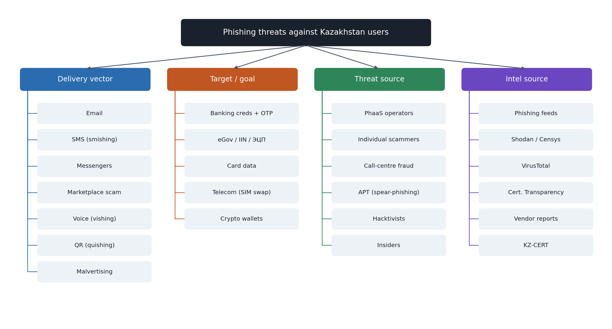
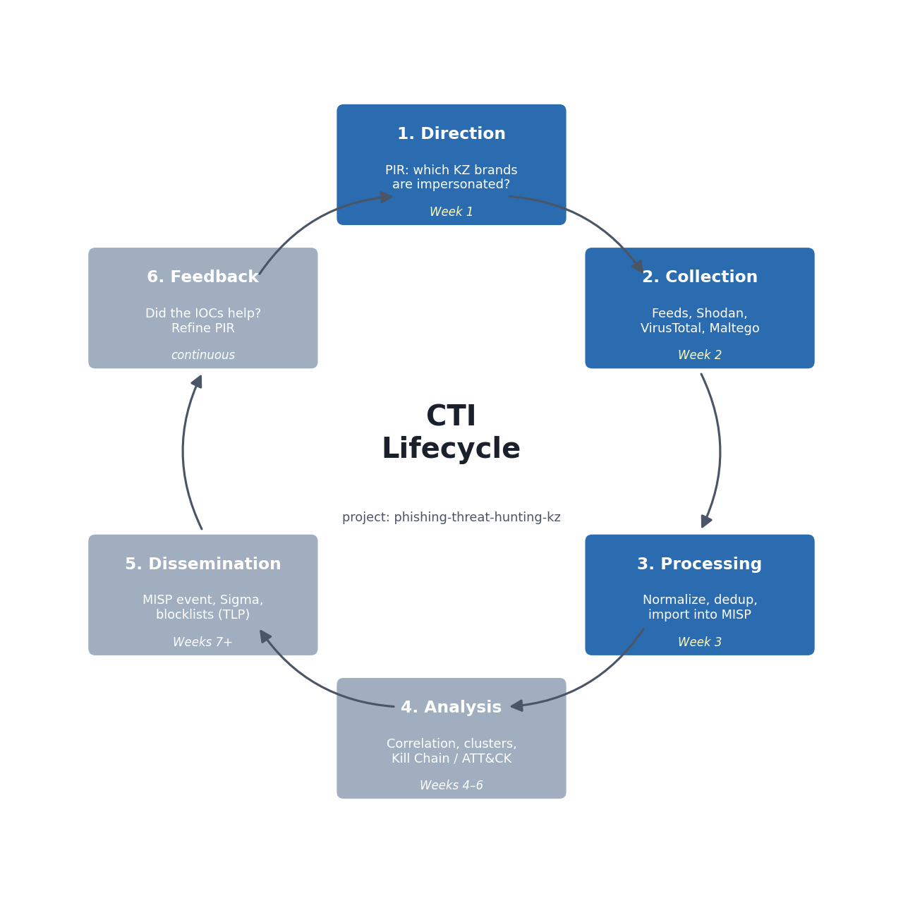

# Week 1: Classification of Threats and Their Sources

Scope: phishing campaigns aimed at users of Kazakhstan services.

## 1. Classification by delivery vector

| Vector | Description | Typical KZ scenario | ATT&CK |
|--------|-------------|---------------------|--------|
| **Email phishing** | Mass or targeted email with a link or attachment | "eGov: your digital signature (ЭЦП) expires, renew here" | T1566.001 / T1566.002 |
| **Smishing (SMS)** | SMS with a short link | "Kazpost: parcel on hold, pay customs fee" | T1566.002 |
| **Messenger phishing** | Links sent via Telegram / WhatsApp | Fake "Kaspi bonus" or prize draw shared in group chats | T1566.003 (Spearphishing via Service) |
| **Marketplace scam** | Fake "safe deal"/delivery page for classified ads | OLX.kz / Kolesa.kz seller receives a link to "receive payment" | T1566.003 |
| **Vishing (voice)** | Phone call pretending to be the bank or police | "Kaspi security service" asks for the SMS code | T1566.004 (Spearphishing Voice) |
| **Quishing (QR)** | QR code leading to a phishing page | Fake QR sticker on a payment terminal or parking meter | T1566 |
| **Malvertising / SEO** | Paid ads or poisoned search results | Search ad for "Halyk Homebank login" leads to a clone | T1583.008 (Malvertising) |

## 2. Classification by target and goal

| Target category | What is stolen | Impacted brands (examples) | Impact |
|-----------------|----------------|----------------------------|--------|
| **Banking / payments** | Login, password, SMS/OTP code, card data | Kaspi, Halyk (Homebank), Jusan, Forte, BCC, Freedom | Direct financial loss |
| **Government services** | IIN, eGov credentials, digital signature (ЭЦП) | eGov.kz, Salyk (tax), ENPF | Identity theft, loans taken in the victim's name |
| **Marketplaces / classifieds** | Card data via fake "delivery" page | OLX.kz, Kolesa.kz, Krisha.kz | Card fraud |
| **Logistics** | Card data for "customs fee" | Kazpost, CDEK | Card fraud |
| **Telecom** | Account takeover, SIM swap | Kcell, Beeline KZ, Tele2/Altel | 2FA bypass |
| **Crypto / investment** | Wallet seed, deposits | Fake exchanges and "Kaspi investments" | Loss of funds |

## 3. Classification of threat sources (actors)

| Actor type | Motivation | Capability | Relevance to our topic |
|------------|-----------|------------|------------------------|
| **Organised cybercriminals / PhaaS operators** | Financial | Medium–High: kits, hosting, Telegram panels | **Primary.** Group-IB (2021) lists Kazakhstan among the countries targeted by Classiscam, and reports a Kazakh version of the fake OLX page in Telegram bots. |
| **Individual scammers ("workers")** | Financial | Low: rent kits from PhaaS | High volume, low skill |
| **Call-centre fraud groups** | Financial | Medium: social engineering scripts | Vishing combined with phishing links |
| **APT / state-sponsored** | Espionage | High | Spear-phishing of government bodies (low volume, high impact) |
| **Hacktivists** | Ideological | Low–Medium | Defacement, credential dumps |
| **Insiders** | Financial / revenge | Varies | Leaks of customer lists used for targeted phishing |

## 4. Classification of intelligence sources

| Source type | Examples | Open / Closed | Intel type |
|-------------|----------|---------------|------------|
| Public phishing feeds | Phishing.Database, OpenPhish, PhishTank, URLhaus | Open | Technical |
| Search engines for infrastructure | Shodan, Censys, urlscan.io | Open (freemium) | Technical |
| Reputation services | VirusTotal, AbuseIPDB | Open (freemium) | Technical |
| Certificate Transparency | crt.sh | Open | Technical / early warning |
| WHOIS / passive DNS | WHOIS, SecurityTrails | Open / Commercial | Technical |
| Vendor reports | Group-IB, Kaspersky, ESET, ENISA | Open | Strategic / Operational |
| National CERT | KZ-CERT (cert.gov.kz) | Open | Operational |
| Sharing communities | MISP communities, ISACs | Closed (membership) | All levels |
| Internal telemetry | Mail gateway logs, DNS logs, user reports | Closed | Tactical / Technical |

## 5. Mapping to the intelligence lifecycle

**Our PIR (Priority Intelligence Requirement):**
> Which Kazakhstan brands are being impersonated in *currently active* phishing infrastructure, where is it hosted, and which indicators can be shared with defenders?

Weeks 2 and 3 answer this PIR through collection (Week 2) and processing (Week 3).

## References

- ENISA Threat Landscape: https://www.enisa.europa.eu/topics/cyber-threats/threat-landscape
- MITRE ATT&CK T1566 Phishing: https://attack.mitre.org/techniques/T1566/
- Group-IB, *Inside Classiscam* (2021): https://www.group-ib.com/blog/classiscam/
- Group-IB, *Unmasking the Classiscam in Central Asia* (2025): https://www.group-ib.com/blog/unmasking-the-classiscam-in-central-asia/
- KZ-CERT: https://cert.gov.kz
