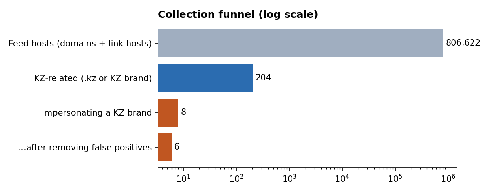
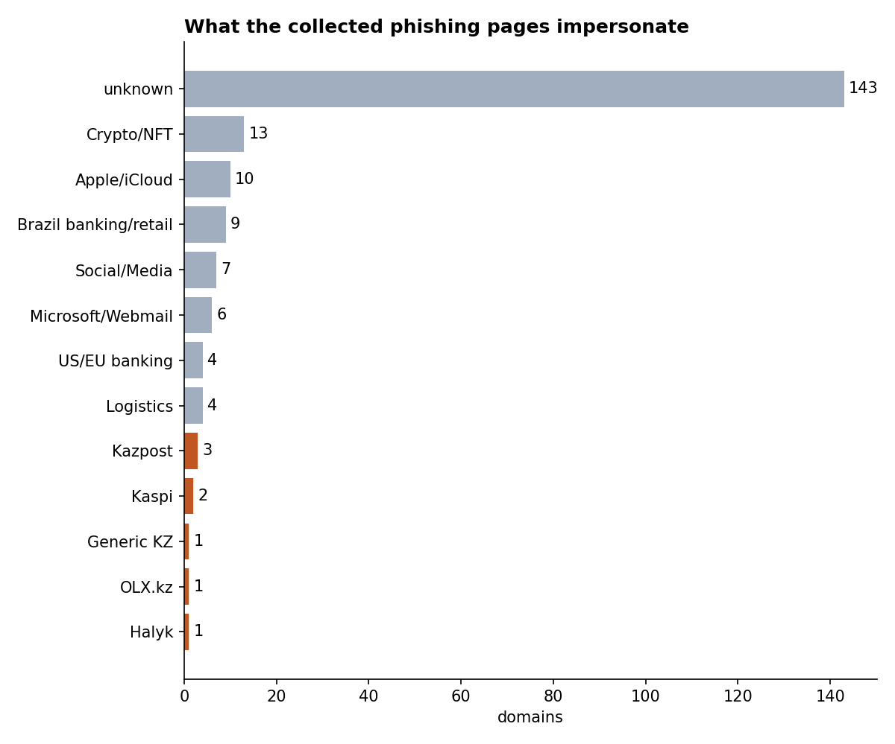
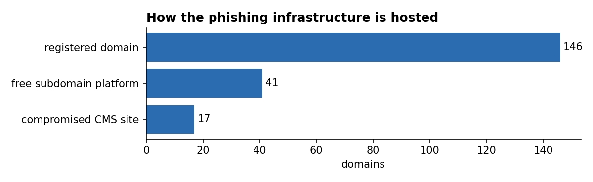
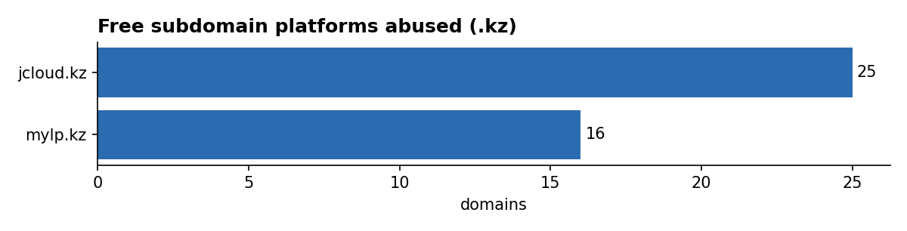
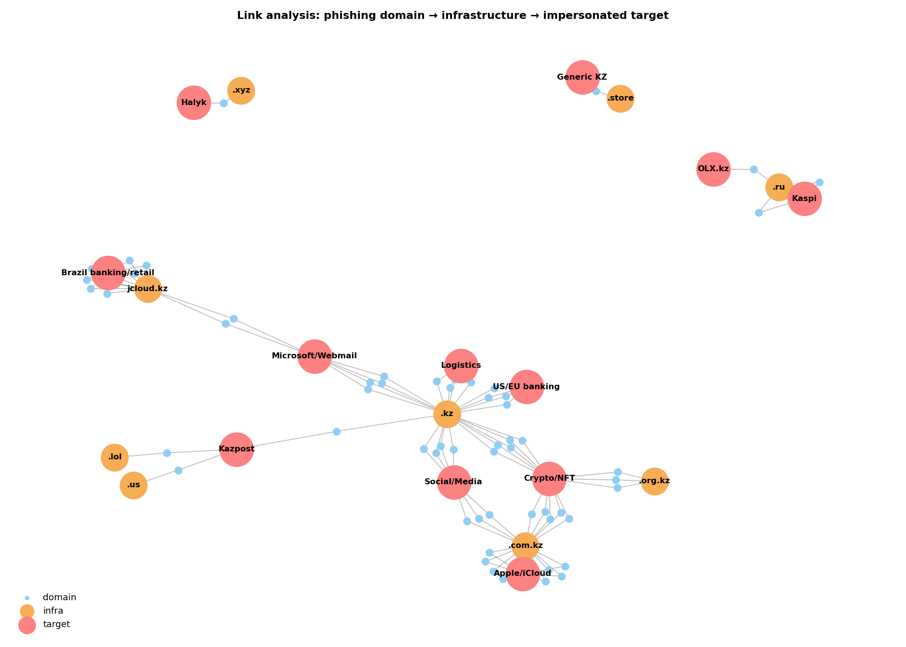

# Week 2: Data Collection Process

**Syllabus tasks (3.3, Week 2):**
1. Perform OSINT data collection using Shodan, VirusTotal and Maltego.
2. Develop a data source mapping for analysis. See [`data-source-mapping.md`](data-source-mapping.md)

Recommended reading: Michael Bazzell, *Open Source Intelligence Techniques*.

---

## 1. Collection plan

| Step | Tool | Script | Output |
|------|------|--------|--------|
| 1 | Open phishing feed (Phishing.Database) | [`scripts/collect_feeds.py`](scripts/collect_feeds.py) | `data/kz_phishing_candidates.csv` |
| 2 | Lookalike generation (dnstwist) | [`scripts/lookalike_check.py`](scripts/lookalike_check.py) | `data/lookalikes_offline.csv` |
| 3 | Shodan (hunting queries + host enrichment) | [`scripts/enrich_shodan.py`](scripts/enrich_shodan.py) | `data/shodan_*.csv` |
| 4 | VirusTotal (domain reputation) | [`scripts/enrich_virustotal.py`](scripts/enrich_virustotal.py) | `data/virustotal_enrichment.csv` |
| 5 | Maltego (link analysis) | [`maltego/`](maltego/README.md) | graph + screenshot |
| 6 | Charts | [`scripts/make_charts.py`](scripts/make_charts.py) | `images/*.png` |

```bash
cd scripts
pip install dnstwist shodan mmh3 requests pandas matplotlib networkx
python3 collect_feeds.py
python3 lookalike_check.py            # add --resolve to check which lookalikes are registered
export SHODAN_API_KEY=...; python3 enrich_shodan.py --queries --hosts ../data/kz_phishing_candidates.csv
export VT_API_KEY=...;     python3 enrich_virustotal.py ../data/kz_phishing_candidates.csv
python3 make_charts.py
```

## 2. Step 1: open phishing feed

We downloaded the **active domains**, **active links** and **inactive links** lists (806,622 unique hosts) and kept only entries that
(a) contain a KZ brand keyword (token-based regex for Kaspi, eGov, Halyk, OLX.kz, Kazpost and 15 more), or (b) are hosted on `.kz`.



**Result: 204 KZ-related entries**, of which 8 impersonate a KZ brand directly:

| Indicator (defanged) | Brand | Observation |
|----------------------|-------|-------------|
| `kaspibank[.]auth-telegramm[.]ru` | Kaspi | Kaspi-themed Telegram account takeover |
| `kaspiy-delfin[.]tarho05[.]ru` | Kaspi | Misspelled brand on a throwaway `.ru` domain |
| `halykbankres[.]xyz` | Halyk | Brand + suffix on a cheap `.xyz` TLD |
| `olxkz[.]pay-sacure4ds[.]ru` | OLX.kz | Fake "3-D Secure payment" page, the typical marketplace-scam pattern |
| `post-kz[.]lol` | Kazpost | Parcel/customs-fee lure |
| `miss-kazakhstan[.]store` | Generic KZ | Low confidence |
| `usps[.]postkz[.]us` | (Kazpost) | **Keyword false positive**: actually a USPS lure |
| `www[.]kazpost[.]kz` | Kazpost | **Feed false positive**: the legitimate site is on the list, so it is excluded via the allowlist |

**What the .kz entries imitate:**





- **Registered lookalikes on `.com.kz` / `.org.kz`:** `opensea[.]com[.]kz`, `uniswap[.]com[.]kz`, `appleid[.]com[.]kz`, `icloud[.]com[.]kz`
- **Compromised Kazakh CMS sites (WordPress / Bitrix)** hosting foreign kits: DHL, DocuSign, Chase, LinkedIn, Navy Federal
- **Free subdomain platforms:** `jcloud[.]kz` (Brazilian banking/webmail phishing) and `mylp[.]kz` (landing-page builder)



## 3. Step 2: lookalike domains (dnstwist)

We generated **20,443 permutations** for 10 brand domains (`kaspi.kz`, `egov.kz`, `homebank.kz`, …) and checked them against the feed.
**0 of them are in the feed.** Attackers don't typosquat inside `.kz`. They put the brand as a *keyword* in a domain on a cheap foreign TLD (`.ru`, `.xyz`, `.lol`).
So **keyword monitoring (CT logs, feeds) is more useful than classic typo monitoring** for KZ brands.

## 4. Step 3: Shodan

The script runs these hunting queries (each excludes the official hosts):

| Query | Idea |
|-------|------|
| `http.title:"Kaspi.kz" -hostname:kaspi.kz` | Page title copied from the original |
| `http.favicon.hash:<hash> -hostname:kaspi.kz` | Kits copy the original favicon, so hashing it finds clones |
| `ssl.cert.subject.cn:*kaspi* -ssl.cert.subject.cn:kaspi.kz` | Certificates issued for brand-containing names |
| `http.title:"eGov.kz" -hostname:egov.kz` | eGov clones |

For every candidate domain it also resolves the IP and pulls **org / ASN / country / open ports**.

> 📸 **TODO (screenshots):** `images/shodan_query.png` (Shodan web UI with one query) and a short excerpt of `data/shodan_host_enrichment.csv`.

## 5. Step 4: VirusTotal

`enrich_virustotal.py` adds **detections, registrar, creation date, categories and A records** (free API: 4 req/min, so it checks the brand rows + 30 others by default).

> 📸 **TODO (screenshots):** `images/virustotal_kaspibank.png` (VT page for `kaspibank.auth-telegramm.ru`) and the output CSV.

## 6. Step 5: Maltego

The Maltego import file is `maltego/maltego_import.csv`, with steps in [`maltego/README.md`](maltego/README.md). The networkx preview of the same data:



> 📸 **TODO (screenshot):** `images/maltego_graph.png` after running DNS/WHOIS transforms.

## 7. Findings (answering the PIRs)

1. **PIR-1:** In global open feeds, KZ brands are **under-represented** (8 of 806k hosts). The most impersonated are Kaspi, Kazpost, Halyk and OLX.kz. Local sources (KZ-CERT, CT logs) are needed for better coverage.
2. **PIR-2:** KZ-brand phishing uses **cheap foreign TLDs** (`.ru`, `.xyz`, `.lol`). The `.kz` zone itself is used mostly as **infrastructure for foreign campaigns**: compromised CMS sites and free platforms like `jcloud.kz`.
3. **PIR-3:** 6 real KZ-brand indicators (after removing 2 false positives) plus 196 `.kz`-hosted indicators are ready to process in Week 3. Two types of false positives were found (feed FP and keyword FP), which shows why normalization and allowlisting are needed.

## 8. Ethics and OPSEC

- Only passive collection: no interaction with phishing forms, no credential submission.
- Indicators are **defanged** in the report. Victim emails found in URLs are **redacted** by the script.
- The report is TLP:CLEAR, since all data comes from public sources.
