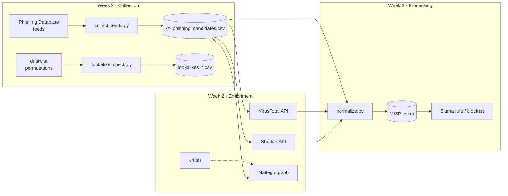

# Week 2: Data Source Mapping

This table maps every data source to what it gives us, which PIR it answers, and how we collect it.
Reliability uses the **Admiralty Code** (source reliability A–F / information credibility 1–6).

| # | Source | Open / Closed | Data type | Key fields | PIR | Collection method | Format | Frequency | Reliability |
|---|--------|---------------|-----------|-----------|-----|-------------------|--------|-----------|-------------|
| 1 | **Phishing.Database** (GitHub) | Open | Domains, URLs (active + inactive) | domain, URL, status | PIR-1, PIR-2 | `collect_feeds.py` (HTTP download) | TXT, 1 IOC per line | Hourly updates, we pull daily | B / 2 (vendor for VirusTotal, known false positives, e.g. `www.kazpost.kz`) |
| 2 | **dnstwist** permutations | Open (generated) | Lookalike domains | domain, fuzzer, DNS A | PIR-1 | `lookalike_check.py` | CSV | On demand | n/a (candidates, not IOCs) |
| 3 | **Shodan** | Open (API key) | Hosts, banners, TLS certs, favicons | IP, port, org, ASN, country, http.title, favicon hash | PIR-2 | `enrich_shodan.py` (API) | JSON → CSV | On demand | A / 2 (direct scan data, can be stale) |
| 4 | **VirusTotal** | Open (API key) | Domain reputation | detections, registrar, creation date, categories, A records | PIR-1, PIR-3 | `enrich_virustotal.py` (API v3) | JSON → CSV | On demand (4 req/min) | B / 2 (aggregated vendor verdicts) |
| 5 | **Maltego CE** | Open (free account) | Relationship graph | domain ↔ IP ↔ NS ↔ MX ↔ WHOIS | PIR-2 | Import `maltego_import.csv` + standard transforms | Graph (.mtgl) | Manual | depends on transforms |
| 6 | **crt.sh** (Certificate Transparency) | Open | TLS certificates | common name, SAN, issuer, date | PIR-1 (early warning) | Web / `https://crt.sh/?q=%25kaspi%25&output=json` | JSON | Daily | A / 1 (logs are cryptographically verifiable) |
| 7 | **urlscan.io** | Open (API key) | Page screenshots, DOM, requests | page title, screenshot, IP, ASN | PIR-1 (confirm impersonation) | Web / API | JSON | On demand | B / 2 |
| 8 | **KZ-CERT** (cert.gov.kz) | Open | Advisories, phishing warnings | campaign description, IOCs | PIR-1 | Manual reading | HTML / PDF | Weekly | A / 2 (national CERT) |
| 9 | **Vendor reports** (Group-IB, Kaspersky, ESET) | Open | Campaign analysis, TTPs | actors, kits, TTPs | Context | Manual reading | PDF / blog | Monthly | B / 2 |
| 10 | **Internal logs** (mail gateway, DNS, proxy) | Closed | Observed traffic | sender, URL, DNS query, user | Future hunting (Weeks 5+) | SIEM (ELK / Splunk) | JSON / syslog | Real time | A / 1 (own telemetry) |

## Data flow

## Field mapping into the common schema (used in Week 3)

| Common field | Phishing.Database | Shodan | VirusTotal | MISP attribute |
|--------------|-------------------|--------|------------|----------------|
| `indicator` | domain / URL host | `hostnames` | `id` | `value` |
| `type` | domain / url | `ip_str` → ip | domain | `domain`, `url`, `ip-dst` |
| `first_seen` | collected_at | `timestamp` | `creation_date` | `first_seen` |
| `brand` | regex match | – | – | tag `brand:*` |
| `hosting` | platform suffix | `org`, `asn` | `a_records` | `ip-dst` + comment |
| `confidence` | 1 source = low | +1 | malicious > 0 = +1 | tag `confidence:*` |
