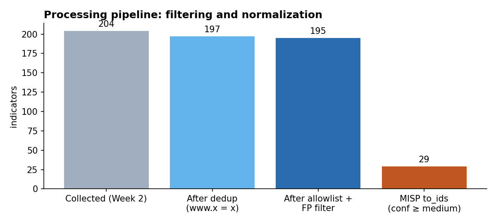
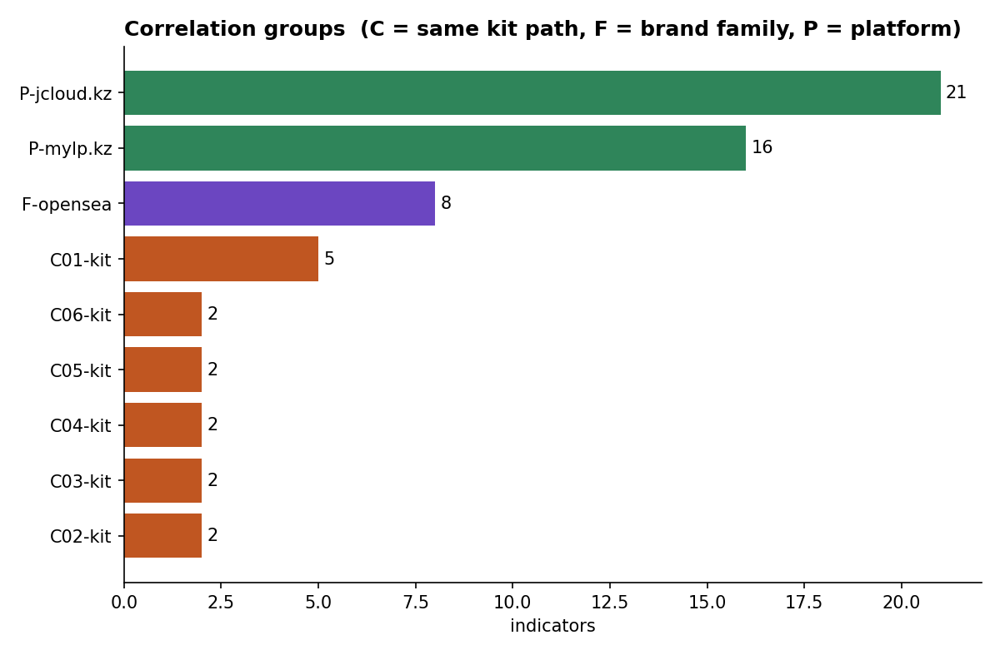

# Week 3: Data Processing and Exploitation

**Syllabus tasks (3.3, Week 3):**
1. Deploy MISP and import IOCs. See [`misp/DEPLOY.md`](misp/DEPLOY.md), [`scripts/misp_import.py`](scripts/misp_import.py)
2. Apply filtering and normalization techniques to the collected data. See [`scripts/normalize.py`](scripts/normalize.py)

Lecture tools: MISP, Elastic Stack, Sigma rules. Recommended reading: MISP Training Documentation.

---

## 1. Pipeline

```mermaid
flowchart LR
    A[Week 2 CSV<br/>204 rows] --> B[Refang<br/>hxxp→http, [.]→.]
    B --> C[Normalize<br/>lowercase, strip www,<br/>IDN→punycode]
    C --> D[Validate<br/>hostname regex]
    D --> E[Deduplicate]
    E --> F[Filter<br/>allowlist + FP list]
    F --> G[URL normalize<br/>drop tracking,<br/>redact emails]
    G --> H[Correlate<br/>kit path, platform,<br/>brand family]
    H --> I[Score<br/>low/medium/high]
    I --> J[(normalized_iocs.csv)]
    J --> K[MISP event JSON]
    J --> L[blocklist.txt]
    J --> M[Sigma rules → Elastic]
```

```bash
cd scripts
pip install pymisp matplotlib
python3 normalize.py          # -> data/normalized_iocs.csv, processing_log.md, blocklist_domains.txt
python3 misp_import.py        # -> data/misp_event.json   (add --push to send to a running MISP)
python3 make_charts.py
python3 ../sigma/test_dns_rule.py
```

## 2. Filtering and normalization results



| Step | Technique | Effect on our data |
|------|-----------|--------------------|
| Refang | `hxxp`→`http`, `[.]`→`.` | Lets us load defanged IOCs from reports |
| Normalize | lowercase, strip `www.`, trailing dot, IDN→punycode | `www.opensea-io.kz` and `opensea-io.kz` become one value |
| Validate | RFC-style hostname regex | 0 invalid values |
| Deduplicate | same normalized value = one IOC | **7** duplicates merged |
| Filter: allowlist | legit brand domains (like MISP warninglists) | removed `kazpost.kz` (**feed false positive**) |
| Filter: analyst FP list | manual review | removed `usps.postkz.us` (**keyword false positive**) |
| URL normalize | drop `utm_*`/`fbclid`, drop fragment, **redact victim emails** | 117 clean example URLs |
| Score | brand match + active + in cluster + VT malicious | 29 medium, 166 low (becomes high after VirusTotal enrichment) |

The full log is in [`data/processing_log.md`](data/processing_log.md).

## 3. Enrichment and correlation

We cluster indicators by a **kit signature**, the URL path with random tokens replaced by `*`. The same phishing kit leaves the same path on every domain it is deployed on.



| Cluster | Kit signature | Members | Interpretation |
|---------|---------------|---------|----------------|
| **C01** | `/m/sing/*` | `appleid[.]com[.]kz`, `appleoficial[.]com[.]kz`, `idapple[.]com[.]kz`, `miaccount[.]com[.]kz`, `soporteapple[.]com[.]kz` | **One Apple ID phishing operator** registering lookalikes in `.com.kz`. The Spanish words ("soporte", "oficial") suggest a Latin American target audience |
| C02 / C05 | `/la/*`, `/m/*` | other Apple `.com.kz` domains | Probably the same operator (same naming, same TLD) |
| C03 / C06 | `/acessomob/loginautentica.php`, `/acessodes/login/logininicial.php` | `*.jcloud.kz` | Brazilian (Portuguese) webmail/banking kit on the Kazakh free hosting jcloud.kz |
| C04 | `/wp-includes/sodium_compat/src/core` | `celinnaya[.]kz`, `joint[.]kz` | **Compromised WordPress sites**, with the kit dropped in the same core folder |
| F-opensea | brand family | 8 `opensea*` lookalikes in `.kz`/`.com.kz`/`.org.kz` | NFT-wallet drainer campaign |

With **Week 2 enrichment** (VirusTotal / Shodan CSVs present), `normalize.py` also merges `vt_malicious` and `shodan_org`. Several domains on the same IP/ASN form another correlation.

## 4. MISP

- Deployment: official `misp-docker`, steps in [`misp/DEPLOY.md`](misp/DEPLOY.md).
- Event file: [`data/misp_event.json`](data/misp_event.json), **312 attributes** (195 domains + 117 URLs), 57 with `to_ids=true` (confidence ≥ medium).
- Event tags: `tlp:clear`, `type:OSINT`, `phishing:techniques="fake-website"`, ATT&CK galaxies **T1566, T1566.002, T1583.001, T1584**.
- Attribute tags: `confidence:*`, `brand:*`, `cluster:*`, so you can filter in the UI by `cluster:C01-kit`.


## 5. Sigma rules (from intelligence to detection)

| Rule | Log source | Logic |
|------|------------|-------|
| [`dns_kz_brand_lookalike.yml`](sigma/dns_kz_brand_lookalike.yml) | DNS | brand keyword in query **and not** official domain (exact or real subdomain) **and not** known FP word |
| [`proxy_kz_phishing_kit_path.yml`](sigma/proxy_kz_phishing_kit_path.yml) | Proxy | kit paths from clusters C01/C03/C06 |

The rules were converted to Elastic (Lucene) with `sigma convert -t lucene` ([`sigma/converted_lucene.txt`](sigma/converted_lucene.txt)):

```
(query:(*kaspi* OR *halyk* OR *homebank* OR *egov* OR *kazpost* OR *post\-kz* OR *olxkz* OR *olx\-kz*))
AND (NOT ((query:(kaspi.kz OR ... OR olx.kz)) OR (query:(*.kaspi.kz OR ... OR *.olx.kz))
     OR (query:(*kaspian* OR *turkiyegov*))))
```

**Offline test** ([`sigma/test_dns_rule.py`](sigma/test_dns_rule.py)) on our 6 KZ-brand IOCs + 11 legitimate queries:

| Version | Detected | Missed | False positives |
|---------|----------|--------|-----------------|
| v1 | 5 / 6 | `miss-kazakhstan.store` (generic, intentionally not covered) | 1: `kaspian-sea.org` |
| v2 (added `filter_known_fp`) | 5 / 6 | same | **0** |
| v3 (official = exact match or `endswith: .kaspi.kz`) | 5 / 6 + evasion test `fakekaspi.kz`, `my-egov.kz` detected | same | **0** |

Why v3: in v2, `endswith: kaspi.kz` also matched `fakekaspi.kz`, so an attacker could hide behind the "official" filter. The leading dot closes that gap.

## 6. Conclusions

1. Normalization matters even for small datasets: 9 of 204 rows (4.4%) were duplicates or false positives.
2. Correlation by **kit signature** turned 195 separate IOCs into a few **campaigns**. That moves us up the Pyramid of Pain, from domains to tools.
3. The `.kz` zone is used as **infrastructure for foreign campaigns** (Apple ID, OpenSea, Brazilian banks). That matters for KZ-CERT and `.kz` registrars (takedown requests).
4. The data is now in MISP and in Sigma/Elastic format, ready for Week 4 (Kill Chain analysis) and Week 5 (hunting in ELK).
