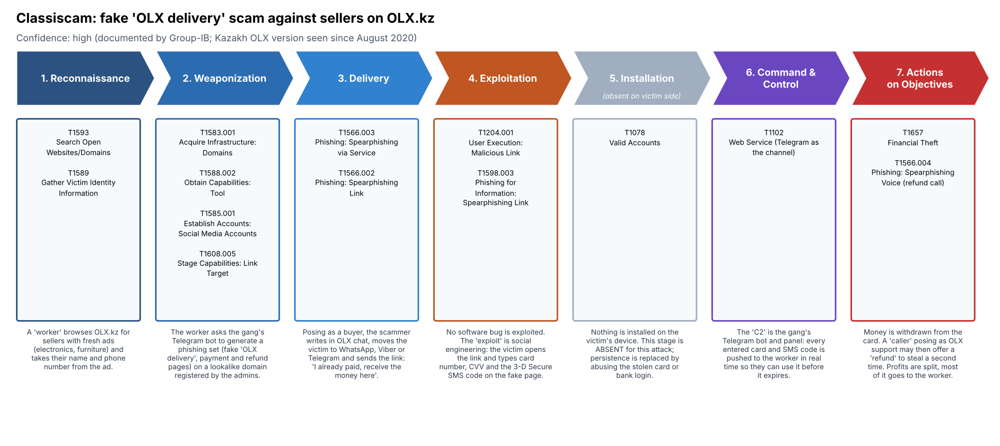
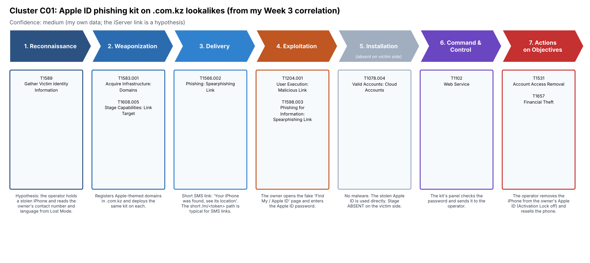
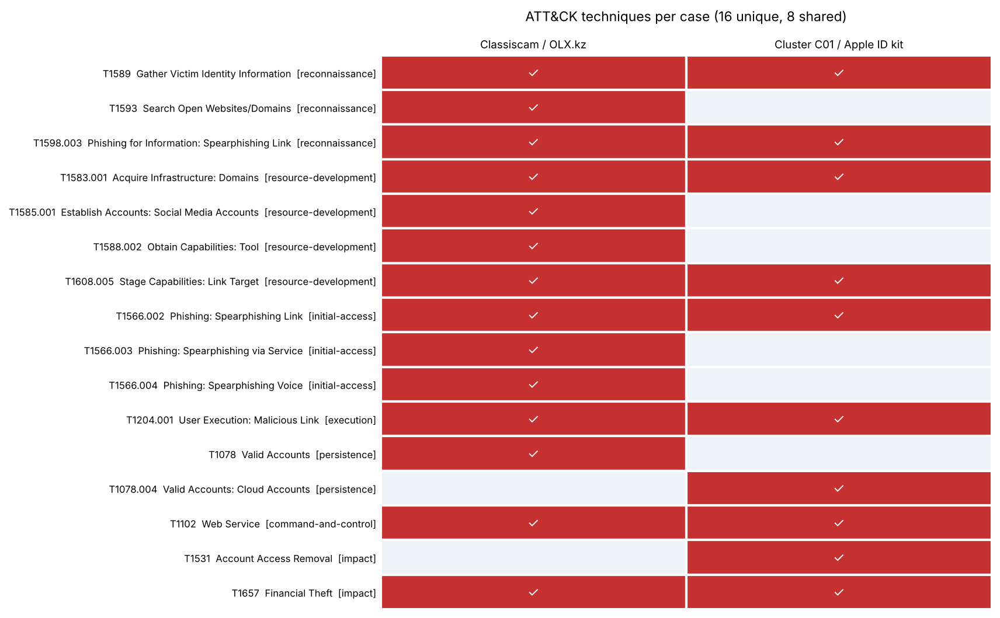

# Week 4: The Cyber Kill Chain

**Course:** Introduction to Threat Hunting (ITH), AITU, 2026–2027
**Author:** Galimzhan Zhandos, CS-2427
**Topic:** Phishing campaigns targeting Kazakhstan users and brands

## Tasks from the syllabus (section 3.3, week 4)

1. Analyze a real-world cyberattack using the stages of the Kill Chain.
2. Map each stage to the corresponding ATT&CK TTPs.

Recommended reading: Lockheed Martin, *Intelligence-Driven Computer Network Defense*.

## What I did

I took two attacks from my topic and walked each one through the 7 stages of the Lockheed Martin Kill Chain:

| # | Case | Why I picked it | Confidence |
|---|------|-----------------|------------|
| A | **Classiscam** — fake "OLX delivery" scam against sellers on OLX.kz | Real, documented campaign. Group-IB saw a Kazakh OLX version since August 2020. My Week 2 feed also had `olxkz[.]pay-sacure4ds[.]ru`. | High |
| B | **Cluster C01** — Apple ID phishing kit on 5 `.com.kz` lookalikes | Comes from my own Week 3 correlation (same kit path `/m/sing/*`). I compare it with the iServer PhaaS taken down in Operation Kaerb (2024). | Medium (iServer link is a hypothesis) |

Then I mapped every stage to ATT&CK Enterprise v16 techniques, built ATT&CK Navigator layers, and wrote a Courses of Action matrix that reuses my Week 3 Sigma rules and MISP event.

## Files

```
week4-cyber-kill-chain/
├── README.md                     this report
├── courses-of-action.md          Lockheed Martin CoA matrix (generated)
├── data/
│   ├── killchain_mapping.json    source of truth: both cases, stages, TTPs, evidence
│   └── killchain_mapping.csv     flat table (generated, 24 rows)
├── images/                       diagrams (generated)
├── navigator/                    ATT&CK Navigator layers (generated)
└── scripts/make_killchain.py     builds everything from the JSON
```

Run: `python3 scripts/make_killchain.py` (needs `matplotlib`).

## Case A: Classiscam on OLX.kz



| Stage | What happens | ATT&CK |
|-------|--------------|--------|
| 1. Reconnaissance | A "worker" scrolls OLX.kz for fresh ads and takes the seller's name and phone. | T1593, T1589 |
| 2. Weaponization | A Telegram bot generates the phishing set (fake delivery, payment and refund pages) on a lookalike domain. | T1583.001, T1588.002, T1585.001, T1608.005 |
| 3. Delivery | "Buyer" writes in OLX chat, moves the seller to WhatsApp/Viber/Telegram and sends the link. | T1566.003, T1566.002 |
| 4. Exploitation | No bug. The victim types card number, CVV and the 3-D Secure code on the fake page. | T1204.001, T1598.003 |
| 5. Installation | **Absent** — nothing is installed. In the "fake bank login" variant the stolen login is reused. | T1078 |
| 6. Command & Control | The gang's Telegram bot/panel pushes each card and SMS code to the worker in real time. | T1102 |
| 7. Actions on Objectives | Money is taken from the card; a fake "OLX support" call may steal a second time. | T1657, T1566.004 |

Scale (Group-IB, 2023): 393 groups with 38,000+ members, about $64.5M earned from H1 2020 to H1 2023, average loss $353.

## Case B: Cluster C01, Apple ID kit on .com.kz



Domains (defanged): `appleid`, `appleoficial`, `idapple`, `miaccount`, `soporteapple` + `[.]com[.]kz`, all with path `/m/sing/<token>`.

| Stage | What happens | ATT&CK |
|-------|--------------|--------|
| 1. Reconnaissance | *Hypothesis:* the operator has a stolen iPhone and reads the owner's contact from Lost Mode. | T1589 |
| 2. Weaponization | Registers Apple-themed `.com.kz` domains and deploys the same kit on each. | T1583.001, T1608.005 |
| 3. Delivery | SMS "Your iPhone was found". The short `/m/<token>` path fits SMS links. | T1566.002 |
| 4. Exploitation | The owner enters the Apple ID password on a fake Find My page. | T1204.001, T1598.003 |
| 5. Installation | **Absent** — the stolen cloud account is used directly. | T1078.004 |
| 6. Command & Control | The kit panel validates the password and sends it to the operator. | T1102 |
| 7. Actions on Objectives | Activation Lock is removed and the phone is resold. | T1531, T1657 |

Why I link it to iServer: Spanish words in the domains (`soporte`, `oficial`, `mi`) match the Spanish-speaking iServer ecosystem, and the flow (stolen phone → SMS → fake Apple page) is the same. I did not find direct proof, so I keep this at medium confidence.

## Both cases in ATT&CK



16 unique techniques, 8 of them are shared. To view in ATT&CK Navigator: open https://mitre-attack.github.io/attack-navigator/ → *Open Existing Layer* → *Upload from local* → `navigator/combined_layer.json`.

<!-- SCREENSHOT: ATT&CK Navigator with combined_layer.json loaded -->

## Courses of Action

Full matrix: [courses-of-action.md](courses-of-action.md). The most useful points for KZ defenders:

- **Weaponization** — detect: my Week 3 Sigma rule `dns_kz_brand_lookalike` and the MISP event; disrupt: takedown requests via KZ-CERT and registrars.
- **Delivery** — OLX can warn the user when a link is sent in chat or when the buyer asks to move to a messenger.
- **Exploitation** — awareness message: to *receive* money you never need CVV or an SMS code.
- **Actions on Objectives** — bank anti-fraud: card-not-present payment right after a 3-DS code request.

## What I learned

1. **The Kill Chain was built for malware intrusions, and phishing fraud breaks it.** Installation is empty in both cases, and "C2" sits on the attacker's side (Telegram bot, kit panel), not on the victim's device. ATT&CK describes these attacks better, because it has separate tactics like Resource Development and techniques like T1566.003.
2. **The earliest cheap win is Weaponization.** Domains are registered before any victim gets a link, so CT-log and feed monitoring (Weeks 2–3) can catch them early.
3. **Most of the Classiscam chain happens outside the bank.** OLX chat and messengers are where the defender has to act.

## Limitations

- Case B mapping for stages 1, 5, 6 is a hypothesis based on the kit's purpose, not on traffic I observed.
- I only used public reports and my own feed data; I did not interact with live phishing pages.

## References

- Lockheed Martin, *Intelligence-Driven Computer Network Defense* (Hutchins, Cloppert, Amin, 2011)
- MITRE ATT&CK Enterprise: https://attack.mitre.org
- Group-IB, *Inside Classiscam*: https://www.group-ib.com/blog/classiscam/
- Group-IB, *Classiscam 2023*: https://www.group-ib.com/media-center/press-releases/classiscam-2023/
- Group-IB, *Unmasking the Classiscam in Central Asia* (2025): https://www.group-ib.com/blog/unmasking-the-classiscam-in-central-asia/
- Group-IB / Europol, *Operation Kaerb* (iServer): https://www.prnewswire.com/news-releases/group-ib-contributes-to-international-operation-kaerb-that-led-to-the-arrest-of-the-masterminds-behind-the-iserver-phishing-as-a-service-platform-which-claimed-more-than-483-000-victims-globally-302253202.html
